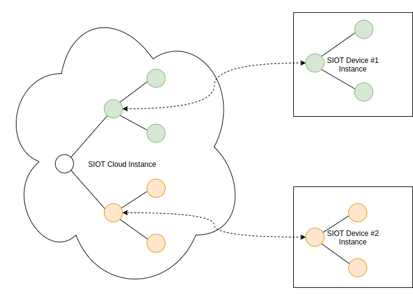
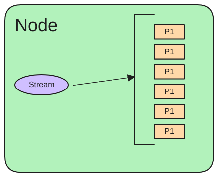
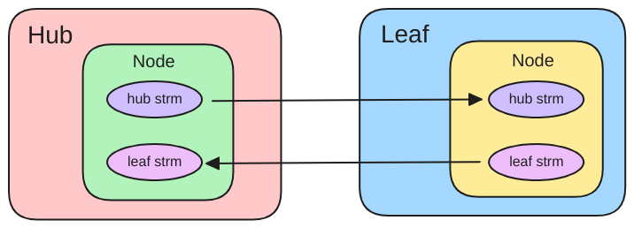

# JetStream SIOT Store

- Author: Cliff Brake, last updated: 2024-01-19
- PR/Discussion:
- Status: discussion

## Problem

SQLite has worked well as a SIOT store. There are a few things we would like to
improve:

- history is not synchronized
  - if a devices or server is offline, only the latest state is transferred when
    connected
- we have to re-compute hashes all the way to the root node anytime something
  changes
  - this may not scale to larger systems
  - is difficult to get right if things are changing while we re-compute hashes
    -- it requires some type of coordination of locking between two systems,
    which we currently don't have.

## Context/Discussion

The purpose of this document is to explore storing SIOT state in a NATS
JetStream store. SIOT data is stored in a tree of nodes and each node contains
an array of points. Note, the term **"node"** in this document represents a data
structure in a tree, not a physical computer or SIOT instance. The term
**"instance"** will be used to represent devices or SIOT instances.

SIOT stores data in a tree of nodes:


Nodes are arranged in a
[directed acyclic graph](https://en.wikipedia.org/wiki/Directed_acyclic_graph).


A subset of this tree is synchronized between various instances as shown in the
below example:



The tree topology can be as deep as required to describe the system. To date,
only the current state of a node is synchronized and history (if needed) is
stored external in a time-series database like InfluxDB and is not currently
synchronized. Overall this has worked very well and node tree has proven to be
an excellent data model.

With JetStream, we could store points in a stream where the head of the stream
represents the current state of a Node or collection of nodes.



NATS Jetstream is a stream based store where every message in a stream is given
a sequence number. Synchronization is simple in that if a sequence number does
not exist on a remote system, the missing samples are sent.

NATS also supports leaf nodes (instances) and streams can be synchronized
between hub and leaf instances. If the are disconnected, then streams are
"caught up" after connection is made again.

Several experiments have been run to understand the basic JetStream
functionality in [this repo](https://github.com/simpleiot/nats-exp).

1. storing and extracting points in a stream
1. using streams to store time-series data and measure performance
1. syncing streams between hub and leaf instances

### Advantages

- JetStream is built into NATS, which we already embed and use.
- History can be stored in a NATS stream instead of externally. Currently we use
  an external store like InfluxDB to store history.
- JetStream streams can be synchronized between instances.
- JetStream has various retention models so old data can automatically be
  dropped.
- Leverage the NATS AuthN/AuthZ features.
- JetStream is a natural extension of core NATS, so many of the core SIOT
  concepts are still valid and do not need to change.

### Challenges

- streams are typically synchronized in one direction. This is challenge for
  SIOT as the basic premise is data can be modified in any location where a
  user/device has proper permissions. A user may change a configuration in a
  cloud portal or on a local touch-screen.
- sequence numbers must be set by one instance, so you can't have both a leaf
  and hub nodes inserting data into a single stream. This has benefits in that
  it is a very simple and reliable model.
- we are constrained by a simple message subject to label and easily query data.
  This is less flexible than a SQL database, but this constraint can also be an
  advantage in that it forces us into a simple and consistent data model.
- SQLite has an excellent caching model. We would likely need to create our own
  with JetStream.

### JetStream consistency model

From this [discussion](https://github.com/nats-io/nats-server/discussions/4577):

> When the doc mentions immediate consistency, it is in contrast to
> [eventual consistency](https://en.wikipedia.org/wiki/Eventual_consistency). It
> is about how 'writes' (i.e. publishing a message to a stream).
>
> JetStream is an immediately consistent distributed storage system in that
> every new message stored in the stream is done so in a unique order (when
> those messages reach the stream leader) and that the acknowledgement that the
> storing of the message has been successful only happens as the result of a
> RAFT vote between the NATS JetStream servers (e.g. 3 of them if replicas=3)
> handling the stream.
>
> This means that when a publishing application receives the positive
> acknowledgement to it's publication to the stream you are guaranteed that
> everyone will see that new message in their updates _in the same order_ (and
> with the same sequence number and time stamp).
>
> This 'non-eventual' consistency is what enables 'compare and set' (i.e.
> compare and publish to a stream) operations on streams: because there can only
> be one new message added to a stream at a time.
>
> To map back to those formal consistency models it means that for writes, NATS
> JetStream is
> [Linearizable](https://jepsen.io/consistency/models/linearizable).

Currently SIOT uses a more "eventually" consistent model where we used data
structures with some light-weight CRDT proprieties. However this has the
disadvantage that we have to do things like hash the entire node tree to know if
anything has changed. In a more static system where not much is changing, this
works pretty well, but in a dynamic IoT system where data is changing all the
time, it is hard to scale this model.

### Message/Subject encoding

In the past, we've used the
[Point datastructure](https://docs.simpleiot.org/docs/adr/1-consider-changing-point-data-type.html#proposal-2).
This has worked extremely well at representing reasonably complex data
structures (including maps and arrays) for a node. Yet it has limitations and
constraints that have proven useful it making data easy to store, transmit, and
merge.

```go
// Point is a flexible data structure that can be used to represent
// a sensor value or a configuration parameter.
// ID, Type, and Index uniquely identify a point in a device
type Point struct {
	//-------------------------------------------------------
	//1st three fields uniquely identify a point when receiving updates

	// Type of point (voltage, current, key, etc)
	Type string `json:"type,omitempty"`

	// Key is used to allow a group of points to represent a map or array
	Key string `json:"key,omitempty"`

	//-------------------------------------------------------
	// The following fields are the values for a point

	// Time the point was taken
	Time time.Time `json:"time,omitempty" yaml:"-"`

	// Instantaneous analog or digital value of the point.
	// 0 and 1 are used to represent digital values
	Value float64 `json:"value,omitempty"`

	// Optional text value of the point for data that is best represented
	// as a string rather than a number.
	Text string `json:"text,omitempty"`

	// catchall field for data that does not fit into float or string --
	// should be used sparingly
	Data []byte `json:"data,omitempty"`

	//-------------------------------------------------------
	// Metadata

	// Used to indicate a point has been deleted. This value is only
	// ever incremented. Odd values mean point is deleted.
	Tombstone int `json:"tombstone,omitempty"`

	// Where did this point come from. If from the owning node, it may be blank.
	Origin string `json:"origin,omitempty"`
}
```

With JetStream, the `Type`and `Key` can be encoded in the message subject:

`p.<node id>.<type>.<key>`

Message subjects are indexed in a stream, so NATS can quickly find messages for
any subject in a stream without scanning the entire stream (see
[discussion 1](https://github.com/nats-io/nats-server/discussions/3772) and
[discussion 2](https://github.com/nats-io/nats-server/discussions/4170)).

Over time, the Point structure has been simplified. For instance, it used to
also have an `Index` field, but we have learned we can use a single `Key` field
instead. At this point it may make sense to simplify the payload. One idea is to
do away with the `Value` and `Text` fields and simply have a `Data` field. The
components that use the points have to know the data-type anyway to know if they
should use the `Value` or `Text`field. In the past, protobuf encoding was used
as we started with quite a few fields and provided some flexibility and
convenience. But as we have reduced the number of fields and two of them are now
encoded in the message subject, it may be simpler to have a simple encoding for
`Time`, `Data`, `Tombstone`, and `Origin` in the message payload. The code using
the message would be responsible for convert `Data` into whatever data type is
needed. This would open up the opportunity to encode any type of payload in the
future in the `Data` field and be more flexible for the future.

Message payload:

- `Time` (uint64)
- `Tombstone` (byte)
- `OriginLen` (byte)
- `Origin` (string)
- `Data` (length determined by the message length)

Putting `Origin` in the message subject will make it inefficient to query as you
will need to scan and decode all messages. Are there any cases where we will
need to do this? (this is an example where a SQL database is more flexible). One
solution would be to create another stream where the origin is in the subject.

### UI Implications

Because NATS and JetStream subjects overlap, the UI could
[subscribe to the current state changes](https://github.com/simpleiot/simpleiot/tree/master/frontend/lib)
much as is done today. A few things would need to change:

- Getting the initial state could still use the
  [NATS `nodes` API](https://docs.simpleiot.org/docs/ref/api.html). However, the
  `Value` and `Text` fields might be merged into `Data`.
- In the `p.<node id>` subscription, the `Type` and `Key` now would come from
  the message subject.

### Bi-Directional Synchronization

Bi-directional synchronization between two instances may be accomplished by
having two streams for every node. The head of both incoming and outgoing
streams is looked at to determine the current state. If points of the same type
exist in both streams, the point with the latest timestamp wins. In reality, 99%
of the time, one set of data will be set by the Leaf instance (ex: sensor
readings) and another set of data will be set by the upstream Hub instance (ex:
configuration settings) and there will be very little overlap.



The question arises -- do we really need bi-directional synchronization and the
complexity of having two streams for every node? Every node includes some amount
of configuration which can flow down from upstream instances. Additionally, many
nodes are collecting data which needs to flow back upstream. So it seems a very
common need for every node to have data flowing in both directions. Since this
is a basic requirement, it does not seem like much of stretch to allow any data
to flow in either stream, and then merge the streams at the endpoints where the
data is used .

### Does it make sense to use NATS to create merged streams?

NATS can merge streams into an additional 3rd stream. This might be useful in
that you don't have to read two streams and merge the points to get the current
state. However, there are several disadvantages:

- data would be stored twice
- data is not guaranteed to be in chronological order -- the data would be
  inserted into the 3rd stream when it is received. So you would still have to
  walk back in history to know for sure if you had the latest point. It seems
  simpler to just read the head of two streams and compare them.

### Timestamps

NATS JetStream messages store a timestamp, but the timestamp is when the message
is inserted into the stream, not necessarily when the sample was taken.
Therefore, an additional high-resolution
[64-bit timestamp](https://docs.simpleiot.org/docs/adr/4-time.html) is added to
the beginning of each message.

### Edges

Edges are used to describe the connections between nodes. Nodes can exist in
multiple places in the tree. In the below example, N2 is a child of N1 and N3.


Edges currently contain the up and downstream node IDs, an array of points, and
a node type. Putting the type in the edge made it efficient to traverse the tree
by only loading edges from a SQLite table and indexing the IDs and type. With
JetStream it is less obvious how to store the edge information. SIOT regularly
traverses up and down the tree.

- down: to discover nodes
- up: to propagate points to up subjects

Because edges contain points that can change over time, edge points need to be
stored in a stream, much like we do the node points. If each node has its own
stream, then the child edges for the node could be stored in the same stream.
This would allow us to traverse the node tree on startup and perhaps cache all
the edges. The following subject can be used for edge points:

`p.<up node ID>.<down node ID>.<type>.<key>`

Again, this is very similar to the existing
[NATS API](https://docs.simpleiot.org/docs/ref/api.html#nats).

Two special points are present in every edge:

- `nodeType`: defines the type of the downstream node
- `tombstone`: set to true if the downstream node is deleted

### NATS `up.*` subjects

In SIOT, we partition the system using the tree structure and nodes that listen
for messages subscribe to the `up.*`stream of their parent node. In the below
example, each group has it's own database configuration and the Db node only
receives points generated in the group it belongs to. This provides an
opportunity for any node at any level in the tree to listen to messages of
another node, as long as:

1. it is equal or higher in the structure
2. shares an ancestor.


The use of "up" subjects would not have to change other than the logic that
re-broadcasts points to "up" subjects would need to use the edge cache instead
of querying the SQLite database for edges.

### AuthN/AuthZ

Authorization typically needs to happen at device or group boundaries. Devices
or users will need to be authorized. Users
[have access](https://docs.simpleiot.org/docs/user/users-groups.html) to all
nodes in their parent group or device. If each node has its own stream, that
will simplify AuthZ. Each device or user are explicitly granted permission to
all of the Nodes they have access to. If a new node is created that is a child
of a node a user has permission to view, this new node (and the subsequent
streams) are added to the list.

### Are we optimizing the right thing?

Any time you move away from a SQL database, you should
[think long and hard](http://www.sarahmei.com/blog/2013/11/11/why-you-should-never-use-mongodb/)
about this. With system design, one approach is to order the problems you are
solving by difficulty with the top of the list being most important/difficult,
and then optimize the system to solve the hard problems first.

1. Synchronizing data between systems (including history)
2. Real-time response
3. Efficient searching through history
4. Flexible data storage/schema
5. Querying nodes and state
6. Arbitrary relationships between data
7. Data encode/decode performance

The number of devices and nodes in systems SIOT is targeting is relatively
small, thus #4 is relatively easy as the dataset can be cached in memory. The
history is a much bigger dataset so using a stream to synchronize and query
makes a lot of sense.

On #6, will we ever need arbitrary relationships between data? With the node
graph, we can do this fairly well. Edges contain points that can be used to
further characterize the relationship between nodes. With IoT systems your
relationships between nodes is mostly determined by physical proximity. A Modbus
sensor is connected to a Modbus, which is connected to a Gateway, which is
located at a site, which belows to a customer.

On #7, the network is relatively slow compared to anything else, so if it takes
a little more time to encode/decode data this is typically not a big deal as the
network is the bottleneck.

With an IoT system, our data is primarily 1) sequential in time, and 2)
hierarchical in structure. This the streaming/tree approach still appears to
make a lot of sense.

### Questions

- How chatty is the NATS Leaf-node protocol? Is it efficient enough to use over
  low-bandwidth Cat-M cellular connections (~20-100Kbps)?
- Is it practical to have 2 streams for every node? A typical edge device may
  have 30 nodes, so this is 60 streams to synchronize. Is the overhead to source
  this many nodes over a leaf connection prohibitive?
- Would it make sense to create streams at the device/instance boundaries rather
  than node boundaries?
  - this may limit our AuthZ capabilities where we want to give some users
    access to only part of a cloud instance.
- How robust is the JetStream store compared to SQLite in events like
  [power loss](https://www.sqlite.org/transactional.html)?

## Decision

what was decided.

objections/concerns

## Consequences

what is the impact, both negative and positive.

## Additional Notes/Reference
