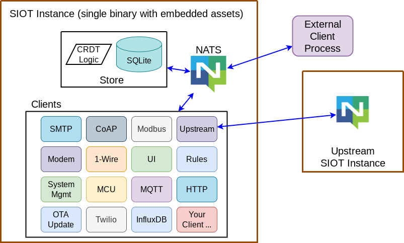

# Architecture

This document describes how the Simple IoT project fulfills the basic
requirements as described in the top level [README](../../).

There are two levels of architecture to consider:

- **[System](architecture-system.md)**: how multiple SIOT instances and other
  applications interact to form a system.
- **[Application](architecture-app.md)**: how the SIOT application is
  structured.

## High Level Overview

Simple IoT functions as a collection of connected, distributed instances that
communicate via NATS. Data in the system is represented by nodes which contain
an array of points. Data changes are communicated by sending points within an
instance or between instances. Points in a node are merged such that newer
points replace older points. This allows granular modification of a node's
properties. Nodes are organized in a DAG (directed acyclic graph). This graph
structure defines many properties of the system such as what data users have
access to, the scope of rules and notifications, and which nodes external
services apply to. Most functionality in the system is implemented in clients,
which subscribe and publish point changes for nodes they are interested in.

