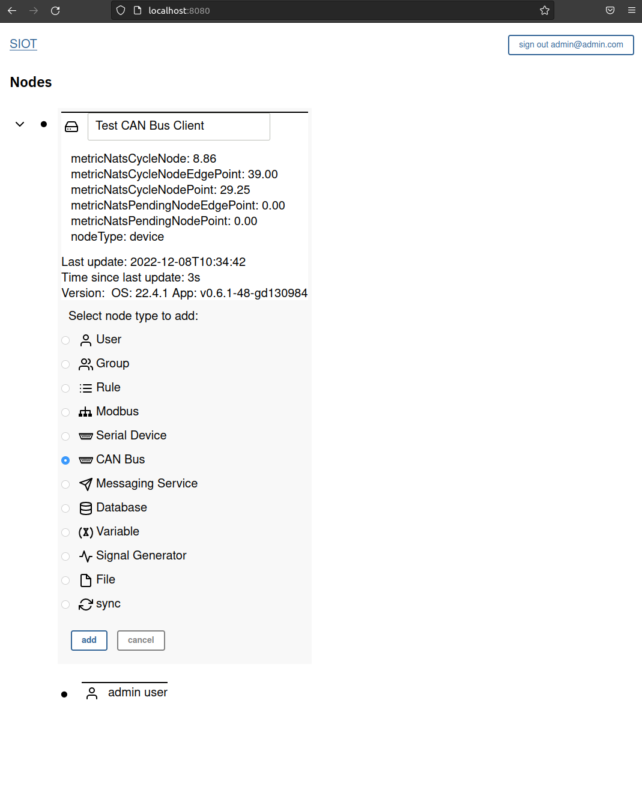
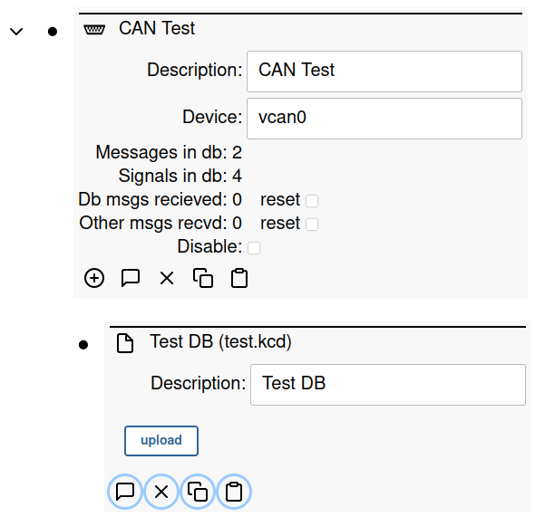

# CAN Bus Client

The CAN client allows loading a standard CAN database file, recieving CAN data, 
and translating the CAN data into points via the database.

## Usage

The CAN client can be used as part of the SimpleIoT library or through the web 
UI. The first step in either case is to create a CAN database in .kbc format.

### Create the CAN Database

Create a file in the folder with the Go code named "test.kcd" containing the following:
```xml
<NetworkDefinition xmlns:xsi="http://www.w3.org/2001/XMLSchema-instance" xmlns="http://kayak.2codeornot2code.org/1.0" xsi:schemaLocation="Definition.xsd">
  <Document name="Some Document Name">some text</Document>
  <Bus name="sampledatabase">
    <Message id="0x123" name="HelloWorld" length="8">
      <Notes></Notes>
      <Signal name="Hello" offset="0" length="8"/>
      <Signal name="World" offset="8" length="8"/>
    </Message>
    <Message id="0x12345678" name="Food" length="8" format="extended">
      <Notes></Notes>
      <Signal name="State" offset="0" length="32"/>
      <Signal name="Type" offset="32" length="32"/>
    </Message>
  </Bus>
</NetworkDefinition>
```

You can create any CAN database you want by crafting it in Kvaser's free DBC editor and
then using the `canmatrix` tool to convert it to KCD format. Note that `canmatrix` does
not support all features of the DBC and KCD formats.

Next, setup the virtual socketCan interface.

### Setup Virtual CAN Interface

Run this in the command line. [Reference](https://www.pragmaticlinux.com/2021/10/how-to-create-a-virtual-can-interface-on-linux/)

```bash
sudo modprobe vcan0
sudo ip link add dev vcan0 type vcan
sudo ip link set up vcan0
```

### Option #1 - Use In Web UI

Follow the [instructions](installation.md) to install SimpleIoT, run it, and 
navigate to the web UI.

Expand the root node and click the + symbol to add a sub node. Select "CAN Bus"
and click "add".



Configure the CAN Bus node with a File subnode and upload the `.kcd` file you
created.



Once the file has been uploaded, you should see the following stats in the
CAN bus node:

Messages in db: 2
Signals in db: 4

### Test with Messages

In a separate terminal:
```
cansend vcan0 123#R{8}
cansend vcan0 12345678#DEADBEEF
```

Ensure that there are no errors logged in the terminal by the application.

In the Web ui you should see the "Db msgs recieved" field increase to 2.

### Option #2 - Use As Library

Copy this code to a Go file on your Linux machine in a folder by itself.

```go
package main

import (
	"log"

	"github.com/nats-io/nats.go"
	"github.com/simpleiot/simpleiot/client"
	"github.com/simpleiot/simpleiot/data"
	"github.com/simpleiot/simpleiot/server"
)

// exNode is decoded data from the client node
type exNode struct {
	ID          string `node:"id"`
	Parent      string `node:"parent"`
	Description string `point:"description"`
	Port        int    `point:"port"`
	Role        string `edgepoint:"role"`
}

// exNodeClient contains the logic for this client
type exNodeClient struct {
	nc            *nats.Conn
	config        client.SerialDev
	stop          chan struct{}
	stopped       chan struct{}
	newPoints     chan client.NewPoints
	newEdgePoints chan client.NewPoints
	chGetConfig   chan chan client.SerialDev
}

// newExNodeClient is passed to the NewManager() function call -- when
// a new node is detected, the Manager will call this function to construct
// a new client.
func newExNodeClient(nc *nats.Conn, config client.SerialDev) client.Client {
	return &exNodeClient{
		nc:            nc,
		config:        config,
		stop:          make(chan struct{}),
		newPoints:     make(chan client.NewPoints),
		newEdgePoints: make(chan client.NewPoints),
	}
}

// Start runs the main logic for this client and blocks until stopped
func (tnc *exNodeClient) Start() error {
	for {
		select {
		case <-tnc.stop:
			close(tnc.stopped)
			return nil
		case pts := <-tnc.newPoints:
			err := data.MergePoints(pts.ID, pts.Points, &tnc.config)
			if err != nil {
				log.Println("error merging new points: ", err)
			}
			log.Printf("New config: %+v\n", tnc.config)
		case pts := <-tnc.newEdgePoints:
			err := data.MergeEdgePoints(pts.ID, pts.Parent, pts.Points, &tnc.config)
			if err != nil {
				log.Println("error merging new points: ", err)
			}
		case ch := <-tnc.chGetConfig:
			ch <- tnc.config
		}
	}
}

// Stop sends a signal to the Start function to exit
func (tnc *exNodeClient) Stop(err error) {
	close(tnc.stop)
}

// Points is called by the Manager when new points for this
// node are received.
func (tnc *exNodeClient) Points(id string, points []data.Point) {
	tnc.newPoints <- client.NewPoints{id, "", points}
}

// EdgePoints is called by the Manager when new edge points for this
// node are received.
func (tnc *exNodeClient) EdgePoints(id, parent string, points []data.Point) {
	tnc.newEdgePoints <- client.NewPoints{id, parent, points}
}

func main() {
	nc, root, stop, err := server.TestServer()

	if err != nil {
		log.Println("Error starting test server: ", err)
	}

	defer stop()

	canBusTest := client.CanBus{
		ID:          "ID-canBus",
		Parent:      root.ID,
		Description: "vcan0",
		Interface:   "vcan0",
	}

	err = client.SendNodeType(nc, canBusTest, "test")
	if err != nil {
		log.Println("Error sending CAN node: ", err)
	}

	// Create a new manager for nodes of type "testNode". The manager looks for new nodes under the
	// root and if it finds any, it instantiates a new client, and sends point updates to it
	m := client.NewManager(nc, newExNodeClient)
	m.Start()

	// Now any updates to the node will trigger Points/EdgePoints callbacks in the above client
}
```

**Run the following commands**:
- `go mod init example.com/m`
- `go run <file>.go`
- Run the `go get` commands suggested by `go run`
- `go mod tidy`
- `go run <file>.go`

#### Run it!

`go run <file.go>`

Follow instructions from the "Test with Messages" section above.

## Future Work
- Scale and translate messages based on scale and offset parameters in database
- Auto connect to CAN bus in case it is brought up after SIOT client is started
- Attempt to bring up CAN bus within client, handle case where it is already up
- Support multiple CAN database files per node (be selective in which internal db is updated when a name or data point is recieved in the client)
- Support sending messages (concept of nodes and send/recieve pulled from databases??)
- Support .dbc file format in addition to .kcd
- Add the concept of a device to the CAN message points
