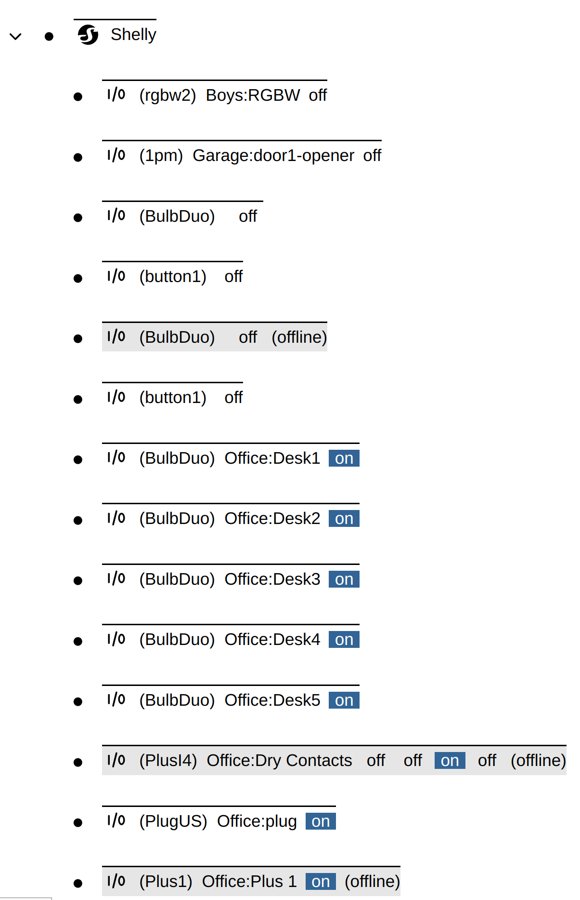
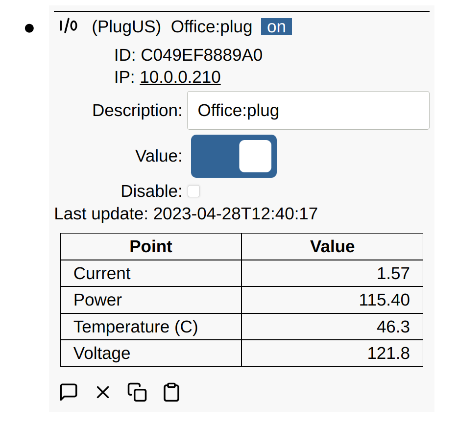

# Shelly IoT

Shelly sells a number of reasonably priced open IoT devices for home automation
and industrial control. Most support WiFi network connections and some of the
Industrial line also supports Ethernet. The API is open and the devices support
a number of communication protocols including HTTP, MQTT, CoAP, etc. They also
support mDNS so they can be discovered on the network.

- [Main website](https://www.shelly.cloud/)
- [Device documention](https://kb.shelly.cloud/knowledge-base/devices)
- [API](https://shelly-api-docs.shelly.cloud/)

Simple IoT provides the following support:

- automatic discovery of all Shelly devices on the network using mDNS
- Support for the following devices:
  - 1pm (not tested)
  - Bulb Duo (on/off only)
  - Plus 1
  - Plus 1PM (not tested)
  - Plus Plug (only US variant tested)
    - measurements such as Current, Power, Temp, Voltage are collected.
  - Plus i4
- Currently status is polled via HTTP every 2 seconds

## Setup

- Configure the Shelly devices to connect to your WiFi network. There are
  several options:
  1. Use the Shelly phone app
  1. A new device will start up in access point mode. Attach a computer or phone
     to this AP, open [http://192.168.33.1](http://192.168.33.1) (default
     address of a reset device), and then configure the WiFi credentials using
     the built-in Web UI.
- Add the Shelly client in SIOT
- The Shelly client will then periodically scan for new devices and add them as
  child nodes.

## Example

## Plug Example

