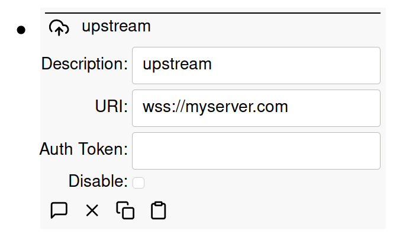

# Upstream connections

Simple IoT provides for simple upstream connections via NATS or NATS over
Websocket. To create an upstream, add an upstream node to the root node on the
downstream instance. If your upstream server has a name of `myserver.com`, then
you can use the following connections URIs:

- `nats://myserver.com:4222` (4222 is the default nats port)
- `ws://myserver.com` (websocket unencrypted connection)
- `wss://myserver.com` (websocket encrypted connection)

IP addresses can also be used for the server name.

Auth token is optional and needs to be
[configured in an environment variable](configuration.md) for the upstream
server. If your upstream is on the public internet, you should use an auth
token. If both devices are on an internal network, then you may not need an auth
token.

Typically, `wss` are simplest for servers that are fronted by a web server like
Caddy that has TLS certs. For internal connections, `nats` or `ws` connections
are typically used.

Occasionally, you might also have edge devices on networks where nats outgoing
connections on port 4222 are blocked. In this case, its handy to be able to use
the `wss` connection, which just uses standard HTTP(S) ports.

