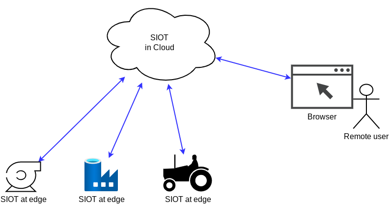
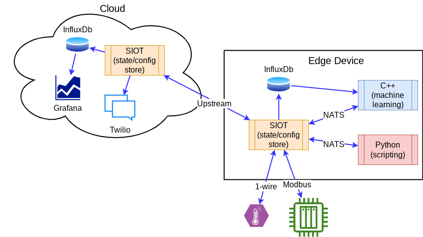
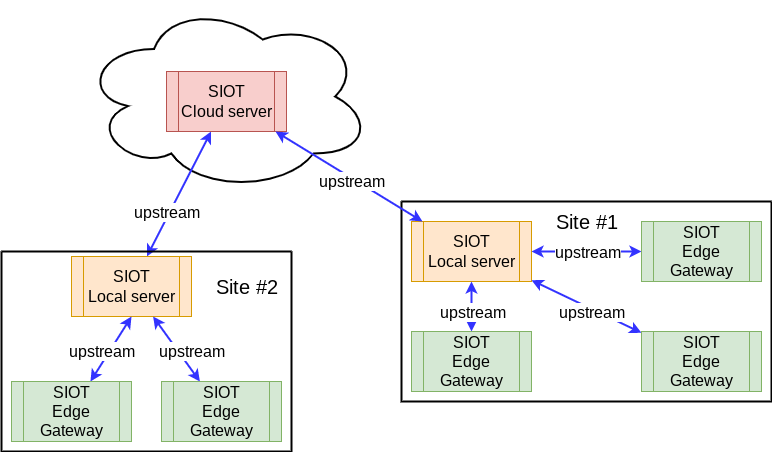

# Use Cases

Simple IoT is platform that can be used to build IoT systems where you want to
synchronize data between a number of distributed devices to a common central
point (typically in the cloud). A common use case is connected devices where
users want to remotely monitor and control these devices.

Some examples systems include:

- [irrigation monitoring](https://youtu.be/REZ6DKvRVv0)
- alarm/building control
- industrial vehicle monitoring (commercial mowers, agricultural equipment, etc)
- factory automation

## Integration

There are many ways to integrate Simple IoT with other applications. Below is an
example:

There are cases where some tasks like machine learning are easier to do in
languages like C++, then you can connect these applications to SIOT via NATS to
access config/state. See the
[Integration reference guide](../ref/integration.md) for more detailed
information.

## Multiple upstreams

Because we run the same SIOT application everywhere, we can add upstream
instances at multiple levels.

This flexibility allows us to run rules at any level (cloud, local server, or
edge gateway) where it makes sense.
